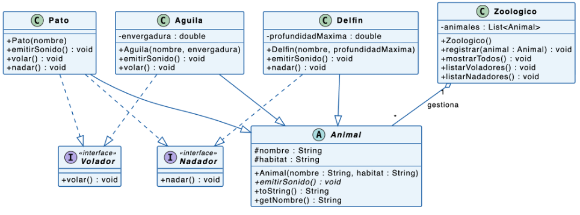

# Ejercicio Preparación Examen Escrito 1

A continuación se le presenta un grupo de ejercicios que deberán resolverlos como preparación para el Examen Escrito 1. Los proyectos sin las modificaciones se encuentran dentro de la carpeta `pre`.

## Ejercicio 1

El zoológico "Terra Viva" necesita un sistema para registrar sus animales. Cada animal tiene datos básicos comunes, pero sus comportamientos varían: algunos pueden volar y otros nadan. El sistema debe mostrar información de todos los animales de forma uniforme y listar aquellos con capacidades especiales.

El diagrama que debe implementar es el siguiente:



En la clase abstracta Animal, el método emitirSonido es abstracto. Los otros tienen una implementación por defecto. La función toString de Animal debe devolver un string que tenga el nombre y el hábitat separado por el carácter “-”.

Para los métodos emitirSonido, nadar y volar, puede poner cualquier implementación.

La respuesta de la función main debería ser la siguiente:

```
Nombre: Aguila 1 Habitat: Cielo
Nombre: Delfin 1 Habitat: Mar
Nombre: Pato 1 Habitat: Lago
=============================
Nombre: Aguila 1 Habitat: Cielo
Nombre: Pato 1 Habitat: Lago
=============================
Nombre: Delfin 1 Habitat: Mar
Nombre: Pato 1 Habitat: Lago
```

Implementar todas las clases que se le piden utilizando Java, en el proyecto (llamado Pregunta1Solucion).

---

## Ejercicio 2

Una empresa de logística dispone de un sistema legacy de seguimiento de envíos que expone datos a través de una interfaz XML. El nuevo sistema moderno de la empresa trabaja exclusivamente con interfaces JSON.
El equipo de desarrollo debe integrar ambos sistemas sin modificar el código legacy ni el nuevo sistema, aplicando un patrón de diseño. Esta implementación se encuentra en el proyecto Pregunta2Solucion que se le ha entregado (NO debe modificar código fuente de este proyecto).

- ¿Qué patrón de diseño se ha implementado en el proyecto Pregunta2Solucion? Su respuesta ponerla en el archivo README.md que se encuentra dentro del proyecto Pregunta2Solucion.
- Se le pide construir un diagrama de clases UML donde se muestren las clases y los atributos del proyecto que se le ha entregado. El diagrama lo puede realizar en cualquier herramienta disponible, y al finalizarlo, ponerlo dentro del proyecto Pregunta2Solucion.

---

## Ejercicio 3

La empresa MediCore está desarrollando una plataforma digital para que los pacientes puedan agendar atenciones médicas completas desde una aplicación web y móvil. Una atención puede incluir registro del paciente, consulta médica, exámenes de laboratorio, farmacia, seguro médico y generación de boleta.

Actualmente, el hospital ya cuenta con varios módulos desarrollados por equipos distintos:
- El módulo de registro valida y almacena los datos del paciente.
- El módulo de agenda busca disponibilidad de médicos y reserva citas.
- El módulo de laboratorio solicita exámenes y registra resultados.
- El módulo de farmacia verifica stock y despacha medicamentos recetados.
- El módulo de seguros verifica cobertura y aplica descuentos del seguro médico.
- El módulo de facturación calcula el monto total y emite la boleta.
- El módulo de notificaciones envía recordatorios y confirmaciones por correo o SMS.

Cada módulo funciona correctamente de manera independiente. Sin embargo, al integrar todo el sistema, el código que controla la experiencia del paciente se ha vuelto difícil de mantener.
Por ejemplo, para que un paciente complete una atención médica con exámenes, el sistema debe realizar varias operaciones en orden:
1. Registrar o autenticar al paciente.
2. Buscar disponibilidad y reservar una cita médica.
3. Verificar si el paciente tiene seguro médico activo y aplicar cobertura.
4. Solicitar los exámenes de laboratorio indicados por el médico.
5. Verificar y despachar medicamentos recetados desde farmacia.
6. Calcular el monto total de la atención.
7. Procesar la facturación y emitir boleta.
8. Enviar confirmación y recordatorios al paciente.

El problema es que las interfaces web y móvil están llamando directamente a los módulos internos. Esto obliga al equipo frontend a conocer detalles como:
- qué clase gestiona la agenda médica;
- en qué orden deben ejecutarse las operaciones;
- cuándo se debe verificar el seguro versus cuándo se factura;
- qué datos necesita cada módulo para funcionar;
- cuándo se debe emitir la notificación final.

Como consecuencia, el código del cliente se ha vuelto repetitivo, extenso y propenso a errores. Además, si cambia la forma en que el laboratorio registra exámenes o la farmacia verifica stock, se deben modificar múltiples partes del sistema.

La empresa desea simplificar este proceso para que las interfaces externas puedan realizar operaciones como:
- agendarConsultaSimple()
- agendarConsultaConExamenes()
- agendarAtencionCompleta()
sin conocer los detalles internos de cada módulo.

A) En base al código entregado en el proyecto Pregunta2Solucion, indique dos principios de ingeniería se software que considera que no se están cumpliedo, sustentando el por qué. Su respuesta ponerla en el archivo README.md que se encuentra dentro del proyecto Pregunta3Solucion. 
B) Determinar qué patrón de diseño estructural debe aplicar para mejorar la arquitectura del sistema. Sustentar el por qué de su respuesta. Su respuesta ponerla en el archivo README.md que se encuentra dentro del proyecto Pregunta3Solucion.
C) Modifique la solución en Java que implemente el patrón elegido. Debe hacerlo directamente en el proyecto que se le ha entregado (Pregunta3Solucion).

---

## Ejercicio 4

Una cadena de escuelas de gastronomía está desarrollando un sistema para administrar sus cocinas de práctica profesional. Una funcionalidad clave del sistema es la generación de planes de sesión, documentos que describen las actividades, tiempos y recursos que se utilizarán durante cada clase práctica.

El sistema debe poder operar en diferentes tipos de sede. Cada tipo de sede genera planes de sesión de manera distinta, adaptados a sus recursos y metodología:
- La Sede Gourmet genera planes de sesión digitales e interactivos, con temporizadores automáticos, listas de insumos sincronizadas con el inventario en la nube y rúbricas de evaluación precargadas.
- La Sede Intermedia genera planes de sesión en formato PDF estructurado, con secciones predefinidas que el docente puede completar antes de imprimir o compartir digitalmente.
- La Sede Comunitaria genera planes de sesión en formato de ficha imprimible simple, con campos básicos de actividad, tiempo estimado y materiales requeridos.

El problema actual es que la clase principal GestorDeSesiones contiene múltiples bloques if/else para decidir qué tipo de plan de sesión crear según la sede. Cada vez que se agrega un nuevo tipo de sede o se modifica la estructura de un plan, se debe modificar directamente esta clase central, lo que viola el principio de abierto/cerrado y hace que el sistema sea difícil de extender y mantener.

La escuela desea reestructurar el sistema para que cada tipo de sede sea responsable de crear su propio plan de sesión, sin que la lógica principal deba conocer las clases concretas que se instancian.

A) En base al código entregado en el proyecto Pregunta4Solucion, indique dos principios de ingeniería se software que considera que no se están cumpliedo, sustentando el por qué. Su respuesta ponerla en el archivo README.md que se encuentra dentro del proyecto Pregunta4Solucion.
B) ¿Qué patrón de diseño creacional considera más adecuado para resolver el problema? Justifique su elección explicando qué problema concreto del caso resuelve el patrón seleccionado. Su respuesta ponerla en el archivo README.md que se encuentra dentro del proyecto Pregunta4Solucion.
C)  Corrija la implementación del código que se le entrega, siguiendo el patrón definido. Debe hacerlo directamente en el proyecto que se le ha entregado, Pregunta4Solucion. 

